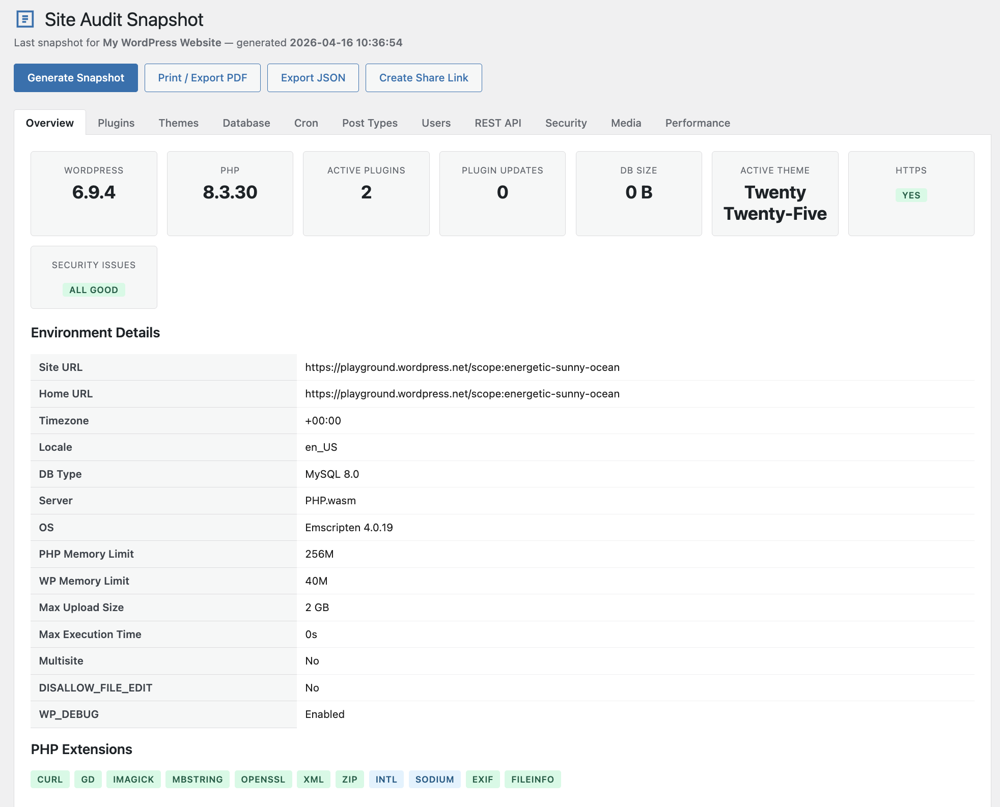
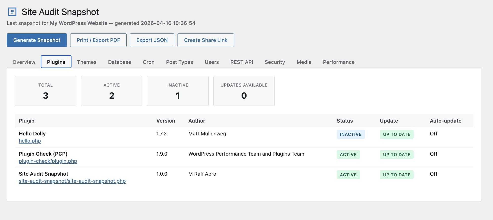
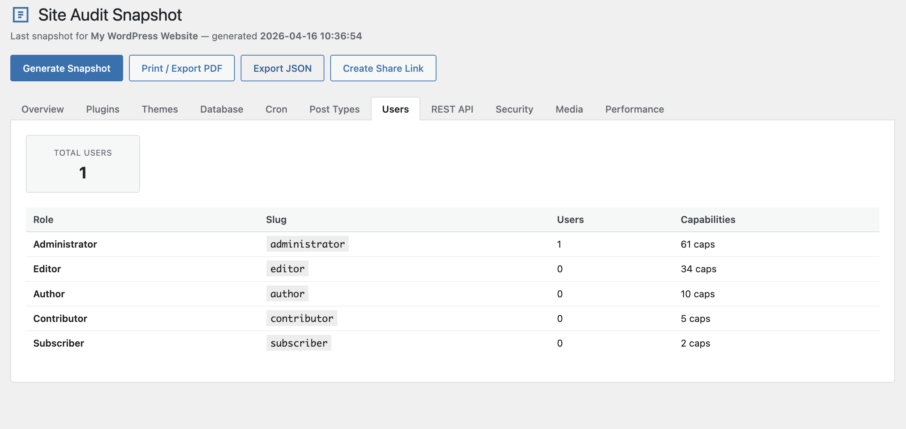
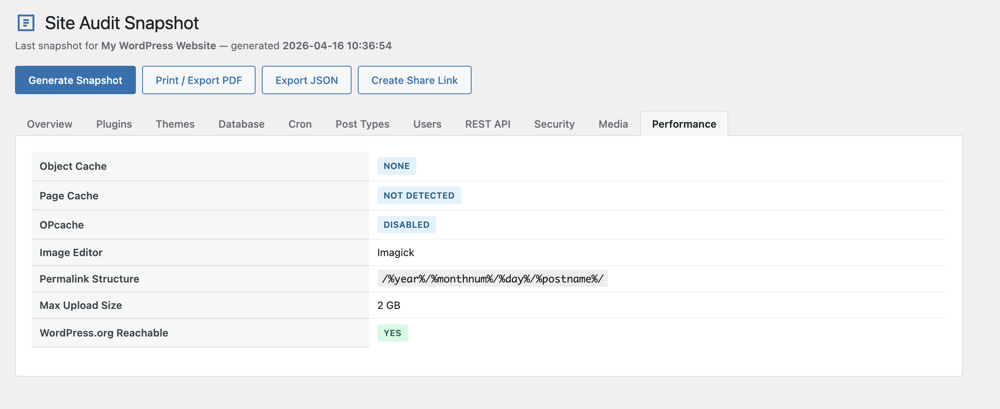
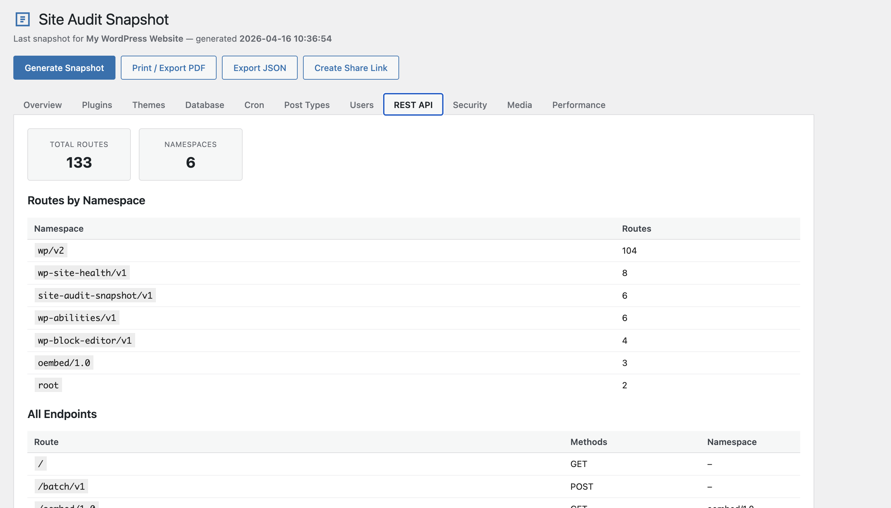

# Site Audit Snapshot

> Generate a complete WordPress site audit report — plugins, themes, server info, database, cron, security, and more. Export as PDF or share via a temporary link.

[](https://wordpress.org/plugins/site-audit-snapshot/)
[](https://www.php.net/)
[](license.txt)
[](https://github.com/mrabro/site-audit-snapshot/releases)

---

## Screenshots

<p>
  
  
</p>
<p>
  
  
</p>
<p>
  
</p>

---

## What's Included

A single click captures a full picture of your WordPress site:

| Section | Details |
|---|---|
| **Environment** | WordPress version, PHP version, database type, server OS, memory limits, multisite, HTTPS, debug mode |
| **Plugins** | Full inventory — active/inactive status, version, update availability, auto-update status |
| **Themes** | Active theme, child/parent detection, block theme (FSE) detection |
| **Database** | Table sizes, total DB size, autoloaded data, revisions, orphaned postmeta, trashed posts |
| **Cron Jobs** | All scheduled events, next run time, overdue detection |
| **Security** | 11 checks with traffic-light status (WP_DEBUG, file editing, HTTPS, DB prefix, XML-RPC, and more) |
| **Media Library** | Total attachments, upload directory size, MIME type breakdown |
| **Performance** | Object cache, OPcache, page cache detection, image editor (Imagick/GD) |
| **Post Types** | All registered custom post types with published post counts |
| **Taxonomies** | All registered taxonomies with term counts |
| **Users & Roles** | Total users, role list with user counts and capabilities |
| **REST API** | Registered endpoint namespaces summary |

---

## Export & Share

- **Print / Save as PDF** — browser print dialog, no server-side library required
- **Temporary share link** — 256-bit cryptographically random token, expires in 72 hours by default (configurable up to 30 days). Sensitive data is automatically redacted.
- **Export JSON** — download raw snapshot data for programmatic use

Snapshot data is stored as a JSON file in `wp-content/uploads/site-audit-snapshot/` — not in the database — avoiding `wp_options` bloat on large sites.

---

## Installation

1. Download the latest release ZIP from [Releases](https://github.com/mrabro/site-audit-snapshot/releases) or install directly from the [WordPress Plugin Directory](https://wordpress.org/plugins/site-audit-snapshot/)
2. Upload and activate via **Plugins → Add New → Upload Plugin**
3. Navigate to **Tools → Site Audit Snapshot**
4. Click **Generate Snapshot**

**Requirements:**
- WordPress 6.5 or higher
- PHP 8.1 or higher

---

## Frequently Asked Questions

**Does this plugin slow down my site?**
No. Site Audit Snapshot only collects data when you explicitly click "Generate Snapshot". It adds zero frontend overhead.

**Is the shared link secure?**
Share links use 256-bit cryptographically random tokens (`random_bytes(32)`) and expire automatically. Sensitive data (database host, database name, absolute file paths) is automatically redacted. Tokens are validated using `hash_equals()` to prevent timing attacks.

**Where is snapshot data stored?**
Snapshots are stored as JSON files in `wp-content/uploads/site-audit-snapshot/`. The directory is protected by an `index.php` drop-in. All files are removed on uninstall.

**Can I extend it with custom data collectors?**
Yes. Use the `wps_collectors` filter to register your own collector class that implements `WPSnapshot\Collector_Interface`.

---

## Developer Hooks

### Filters

```php
// Add, remove, or reorder data collectors.
add_filter( 'wps_collectors', function ( array $collectors ): array {
    $collectors[] = My_Custom_Collector::class;
    return $collectors;
} );

// Modify snapshot data before it is saved.
add_filter( 'wps_snapshot_data', function ( array $data ): array {
    $data['custom_section'] = [ 'key' => 'value' ];
    return $data;
} );
```

### Actions

```php
// Fires immediately before snapshot generation starts.
add_action( 'wps_before_generate', function (): void {} );

// Fires after generation. Receives the full snapshot array.
add_action( 'wps_after_generate', function ( array $snapshot ): void {} );

// Fires when a share link is created. Receives token and expiry timestamp.
add_action( 'wps_share_created', function ( string $token, int $expires_at ): void {}, 10, 2 );

// Fires when a share link is accessed. Receives the token string.
add_action( 'wps_share_accessed', function ( string $token ): void {} );
```

---

## REST API

All endpoints require the `manage_options` capability and a valid `X-WP-Nonce` header.

| Method | Endpoint | Description |
|---|---|---|
| `POST` | `/wp-json/site-audit-snapshot/v1/generate` | Generate a new snapshot |
| `GET` | `/wp-json/site-audit-snapshot/v1/snapshot` | Retrieve the last saved snapshot |
| `GET` | `/wp-json/site-audit-snapshot/v1/pdf` | Get printable HTML report |
| `POST` | `/wp-json/site-audit-snapshot/v1/share` | Create a temporary share link |
| `DELETE` | `/wp-json/site-audit-snapshot/v1/share/{token}` | Revoke a share link |

---

## Contributing

Contributions are welcome! This plugin is open source under the GPLv2 license.

1. Fork the repository
2. Create a feature branch: `git checkout -b feature/my-feature`
3. Commit your changes: `git commit -m "Add my feature"`
4. Push and open a Pull Request

Found a bug? [Open an issue](https://github.com/mrabro/site-audit-snapshot/issues).

---

## License

Site Audit Snapshot is licensed under the [GNU General Public License v2.0 or later](license.txt).

Copyright (C) 2026 [M Rafi Abro](https://github.com/mrabro)
